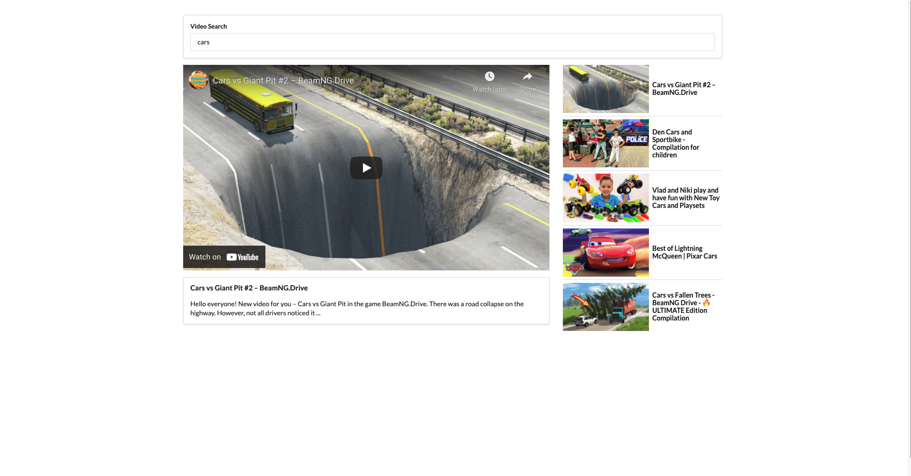
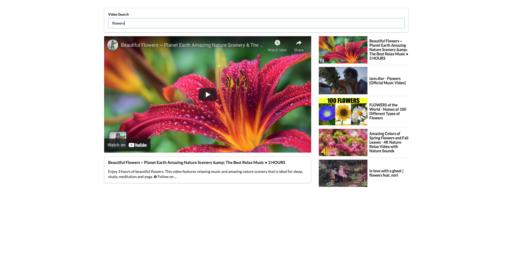

# Youtube Video Search

## Description

This is a Mock YouTube app built while taking the Udemy course "Modern React with Redux" by Stephen Grider.

## Table of Contents
[Deployed Site](https://github.com/sranson/videoSearch#deployed-site)

[Screenshots](https://github.com/sranson/videoSearch#Screenshots)

[Contributing](https://github.com/sranson/videoSearch#Contributing)

## Deployed Site
[Mock YouTube Site](https://sranson.github.io/videoSearch//)

## Screenshots

 

 

## Contributing

Stephen Grider (Instructor)
